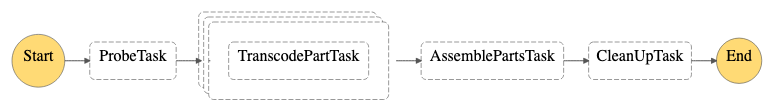

# Welcome to my lambda transcoder

This is a POC of how to use lambda to transcode video files.

The `cdk.json` file tells the CDK Toolkit how to execute your app.

## Useful commands

 * `npm run build`   compile typescript to js
 * `npm run watch`   watch for changes and compile
 * `npm run test`    perform the jest unit tests
 * `cdk deploy`      deploy this stack to your default AWS account/region
 * `cdk diff`        compare deployed stack with current state
 * `cdk synth`       emits the synthesized CloudFormation template

## Getting Started

To get started first initialize the cdk using `npx cdk bootstrap`. Then deploy this app using `npm run build` followed by `npx cdk deploy`.

Once the app is deployed, simply upload a video file to the `source/` directory inside the `SourceBucket` that is created to trigger the pipeline (you will need to manually create the `source/` directory).

This is still a work in progress so it doesn't work on big videos just yet, I recommend a ~60mb `.mov` file as that's what I was testing with.

## How it works

1. When a file is uploaded to the `SourceBucket`'s `source/` directory a lambda called `OnUploadInitTranscodeHandler` is triggered.
2. `OnUploadInitTranscodeHandler` takes the `Key` and `Bucket` of the uploaded file and kicks off a `TranscodeMachine` execution.
3. The `TranscodeMachine` consists of:
   1. A `ProbeTask` that reads the file and creates a list of **start+end** times so we can parallelize the transcoding in 5s chunks.
   2. A `TranscodeParts` task that takes the list of **start+end** times and triggers an `TranscodePartTask` for each 5s chunk to process in parallel.
   3. An `AssemblePartsTask` that takes all the chunks produced by the `TranscodePartTask`s and concats their outputs into a single file in the `output/` directory of the `SourceBucket`.
   4. Finally a `CleanUpTask` is fired to clean up all the temporary chunks created by the `TranscodePartTasks`s.

